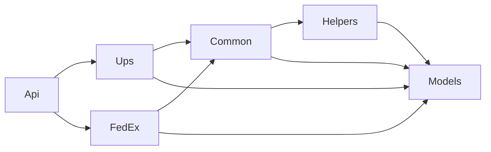

# Shipping API

An ASP.NET Core minimal API that validates shipping addresses through multiple shipping providers (UPS, FedEx). It demonstrates how to solve a real-world integration problem: a customer's internal web app needs to validate addresses against several shipping carriers, each with its own request schema and API contract.

An internal web app POSTs a `shippingCompanyId` and `addressId`. The API looks up the address in a database, builds a provider-specific JSON payload for that carrier, and forwards it to the provider's address validation endpoint.

> [!NOTE]
> This project does not call live provider APIs. `UpsHttpClient` and `FedExHttpClient` simply echo the serialized payload back to the caller — the real `PostAsync` call is commented out, since there are no live UPS/FedEx developer accounts backing this demo. It exists to showcase the request-building architecture, not a production integration.

## Features

- **Multi-provider address validation** — UPS and FedEx today, with a pattern designed to add more without touching existing code.
- **Provider-keyed factory-of-factories dispatch** — the right request builder and HTTP client are resolved at request time from a `ShippingProviderType`, not wired up per-provider at compile time.
- **Builder pattern for provider payloads** — each provider's wire format (UPS's nested `XAVRequest.AddressKeyFormat`, FedEx's `AddressesToValidate`) is modeled with private DTOs local to that provider's builder, kept separate from the shared `Address` model.
- **Auth0-protected endpoint** — `POST /validate-address` requires a valid JWT bearer token.
- **Swagger UI** for exploring and testing the endpoint locally.

## Architecture

Six projects, with dependencies flowing one way:



| Project | Responsibility |
|---|---|
| [Models](Models) | Plain POCOs shared everywhere (`Address`, `ShippingCompany`, `AddressValidationRequest`, `ShippingProviderType`). No dependencies. |
| [Helpers](Helpers) | `SerializationHelper`, a thin `System.Text.Json` wrapper. No dependencies. |
| [Common](Common) | Provider-agnostic contracts every provider implements: `IAddressValidationRequestBuilder`, `IAddressValidationRequestBuilderFactory`, `IShippingProviderHttpClient`, `IShippingProviderHttpClientFactory`, `ISerializableRequest`. |
| [Ups](Ups) / [FedEx](FedEx) | One project per shipping provider, each implementing the `Common` contracts with that provider's own request schema. |
| [Api](Api) | The ASP.NET Core host: the minimal API endpoint, an EF Core InMemory `DbContext`, DI wiring, and the factory-of-factories that dispatches by provider. |

### Request flow

1. `Api/Program.cs` receives `POST /validate-address` with a `shippingCompanyId` and `addressId`.
2. `AddressValidationBuilderFactory` resolves the matching `IAddressValidationRequestBuilder` for that provider.
3. `AddressService` loads the `Address` from `ShippingDb`.
4. The builder turns the `Address` into the provider's JSON payload and serializes it.
5. `ShippingProviderHttpClientFactory` resolves the matching `IShippingProviderHttpClient` and sends the payload to the provider's endpoint (looked up via `UriEndpointProvider`).

Both factories derive from [`BaseFactory<TFactory>`](Api/Factories/BaseFactory.cs), which validates the `shippingCompanyId` and resolves the right per-provider factory through an injected `Func<ShippingProviderType, TFactory>` delegate. See [CLAUDE.md](CLAUDE.md) for a deeper walkthrough of the dispatch pattern and step-by-step instructions for adding a new provider.

## Getting started

### Prerequisites

- [.NET 8 SDK](https://dotnet.microsoft.com/download/dotnet/8.0)
- An [Auth0](https://auth0.com/) tenant (for issuing bearer tokens against the protected endpoint)

### Setup

1. Clone the repository and restore dependencies:

   ```bash
   dotnet restore
   ```

2. Create `Api/appsettings.Development.json` (gitignored — it holds provider API keys) with the following shape:

   ```json
   {
     "Auth0": { "Domain": "...", "Audience": "..." },
     "UpsHttpClient": { "BaseAddress": "...", "ApiKey": "...", "AddressValidationEndpoint": "..." },
     "FedExHttpClient": { "BaseAddress": "...", "ApiKey": "...", "AddressValidationEndpoint": "..." }
   }
   ```

3. Run the API:

   ```bash
   dotnet run --project Api
   ```

   Swagger UI opens at `/swagger`. For hot reload during development, use `dotnet watch --project Api run` instead.

### Try it out

Two seeded addresses and two seeded shipping companies (`1` = UPS, `2` = FedEx) are available out of the box via the InMemory database — see [Api/shipping-api.http](Api/shipping-api.http) for ready-to-run requests:

```http
POST http://localhost:5242/validate-address
Content-Type: application/json
Authorization: Bearer <token>

{
    "ShippingCompanyId": 1,
    "AddressId": 1
}
```

The response is the serialized provider payload that would have been sent to UPS or FedEx.

## Adding a new shipping provider

The provider-keyed factory pattern is designed so a new carrier can be added without touching existing provider code:

1. Add a value to `ShippingProviderType`.
2. Create a new project mirroring the `Ups`/`FedEx` layout (`Builders/`, `Factories/`, `HttpClients/`), implementing the `Common` interfaces.
3. Register the project in `shipping-api.sln` and reference it from `Api.csproj`.
4. Wire it into `ApplicationServiceExtensions` — an `Add<Provider>HttpClient` method, factory registrations, and a `ShippingProviderType` mapping in both resolver dictionaries.
5. Add the provider's config section and extend `UriEndpointProvider` with its endpoint lookup.

Full details, including which parts of the pattern must stay in sync, are documented in [CLAUDE.md](CLAUDE.md).

## Deployment

[create-azure-app-service.ps1](create-azure-app-service.ps1) provisions a resource group, a Free-tier App Service plan, and an App Service on Azure via the Azure CLI as a starting point for hosting the API.

> [!IMPORTANT]
> There is no test project in this solution currently, and the data layer is EF Core's InMemory provider seeded with hardcoded rows — there is no real database or migrations. Both stand in for pieces that would back a production deployment.
